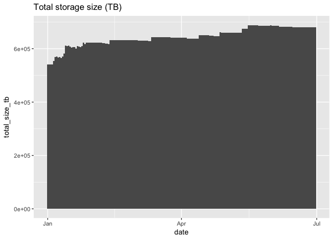
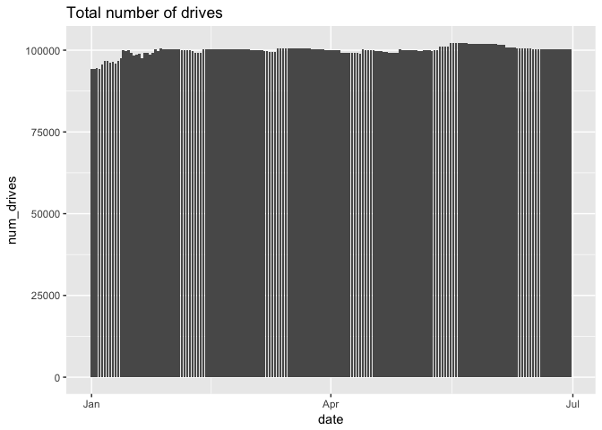
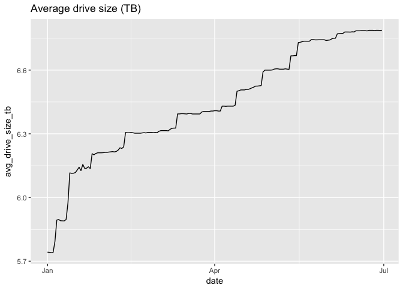
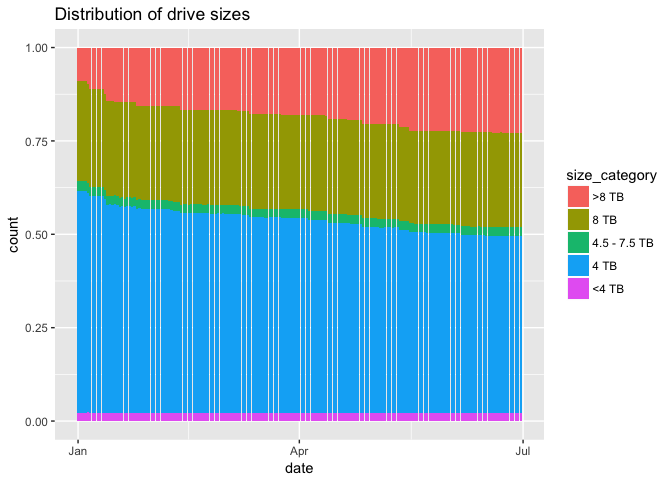
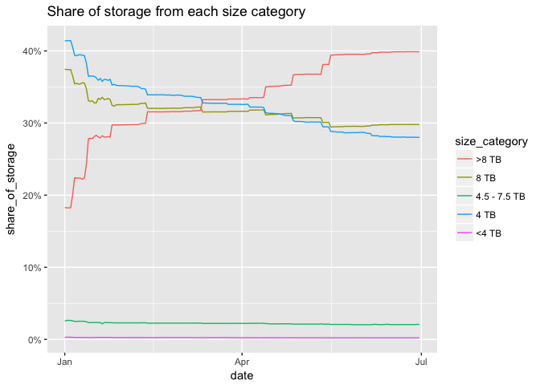
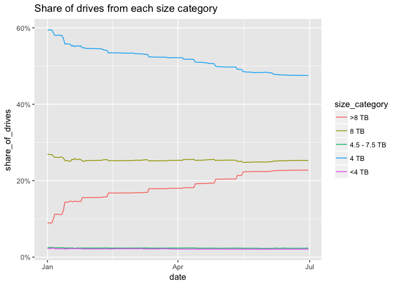
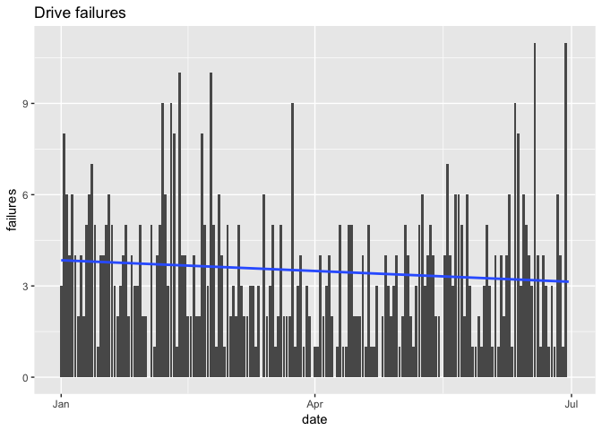
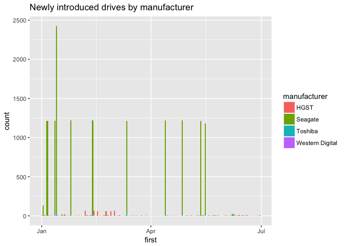

Backblaze harddrive data
================

First, load the relevant packages.

``` r
library(tidyverse) # For exploratory data analysis; dplyr, ggplot2, etc.
library(feather) # For reading in the data (the actual reading is done in a separate script)
```

Read in one daily file and explore the contents.

``` r
data <- read_csv("data/2018Q2/2018-04-01.csv", progress = FALSE)
head(data)
```

    ## # A tibble: 6 x 109
    ##   date       serial_number  model  capacity_bytes failure smart_1_normali…
    ##   <date>     <chr>          <chr>           <dbl>   <int>            <int>
    ## 1 2018-04-01 Z305B2QN       ST400… 4000787030016.       0              117
    ## 2 2018-04-01 PL1331LAHG1S4H HGST … 4000787030016.       0              100
    ## 3 2018-04-01 ZA16NQJR       ST800… 8001563222016.       0               81
    ## 4 2018-04-01 ZA18CEBT       ST800… 8001563222016.       0               73
    ## 5 2018-04-01 ZA18CEBS       ST800… 8001563222016.       0               80
    ## 6 2018-04-01 Z305DEMG       ST400… 4000787030016.       0              117
    ## # ... with 103 more variables: smart_1_raw <int>,
    ## #   smart_2_normalized <int>, smart_2_raw <int>, smart_3_normalized <int>,
    ## #   smart_3_raw <int>, smart_4_normalized <int>, smart_4_raw <int>,
    ## #   smart_5_normalized <int>, smart_5_raw <int>, smart_7_normalized <int>,
    ## #   smart_7_raw <dbl>, smart_8_normalized <int>, smart_8_raw <int>,
    ## #   smart_9_normalized <int>, smart_9_raw <int>,
    ## #   smart_10_normalized <int>, smart_10_raw <int>,
    ## #   smart_11_normalized <int>, smart_11_raw <int>,
    ## #   smart_12_normalized <int>, smart_12_raw <int>,
    ## #   smart_13_normalized <chr>, smart_13_raw <chr>,
    ## #   smart_15_normalized <chr>, smart_15_raw <chr>,
    ## #   smart_22_normalized <int>, smart_22_raw <int>,
    ## #   smart_23_normalized <chr>, smart_23_raw <chr>,
    ## #   smart_24_normalized <chr>, smart_24_raw <chr>,
    ## #   smart_177_normalized <chr>, smart_177_raw <chr>,
    ## #   smart_179_normalized <chr>, smart_179_raw <chr>,
    ## #   smart_181_normalized <chr>, smart_181_raw <chr>,
    ## #   smart_182_normalized <chr>, smart_182_raw <chr>,
    ## #   smart_183_normalized <int>, smart_183_raw <int>,
    ## #   smart_184_normalized <int>, smart_184_raw <int>,
    ## #   smart_187_normalized <int>, smart_187_raw <int>,
    ## #   smart_188_normalized <int>, smart_188_raw <dbl>,
    ## #   smart_189_normalized <int>, smart_189_raw <int>,
    ## #   smart_190_normalized <int>, smart_190_raw <int>,
    ## #   smart_191_normalized <int>, smart_191_raw <int>,
    ## #   smart_192_normalized <int>, smart_192_raw <int>,
    ## #   smart_193_normalized <int>, smart_193_raw <int>,
    ## #   smart_194_normalized <int>, smart_194_raw <int>,
    ## #   smart_195_normalized <int>, smart_195_raw <int>,
    ## #   smart_196_normalized <int>, smart_196_raw <int>,
    ## #   smart_197_normalized <int>, smart_197_raw <int>,
    ## #   smart_198_normalized <int>, smart_198_raw <int>,
    ## #   smart_199_normalized <int>, smart_199_raw <int>,
    ## #   smart_200_normalized <int>, smart_200_raw <int>,
    ## #   smart_201_normalized <chr>, smart_201_raw <chr>,
    ## #   smart_220_normalized <int>, smart_220_raw <int>,
    ## #   smart_222_normalized <int>, smart_222_raw <int>,
    ## #   smart_223_normalized <int>, smart_223_raw <int>,
    ## #   smart_224_normalized <int>, smart_224_raw <int>,
    ## #   smart_225_normalized <int>, smart_225_raw <int>,
    ## #   smart_226_normalized <int>, smart_226_raw <int>,
    ## #   smart_235_normalized <chr>, smart_235_raw <chr>,
    ## #   smart_240_normalized <int>, smart_240_raw <dbl>,
    ## #   smart_241_normalized <int>, smart_241_raw <dbl>,
    ## #   smart_242_normalized <int>, smart_242_raw <dbl>,
    ## #   smart_250_normalized <chr>, smart_250_raw <chr>,
    ## #   smart_251_normalized <chr>, smart_251_raw <chr>,
    ## #   smart_252_normalized <chr>, smart_252_raw <chr>,
    ## #   smart_254_normalized <int>, …

Read all files in one `tbl_df`:

``` r
if (!file.exists("data/all_data.feather")) {
  source("read_data.R")
}

tbl <- read_feather("data/all_data.feather")
```

Let's drop the [S.M.A.R.T. values](https://en.wikipedia.org/wiki/S.M.A.R.T.) for now.

``` r
drive_data_small <- tbl %>%
  select(-starts_with("smart"))
```

### Exploratory plots:

 

 



 

### Which manufacturer is Backblaze buying the most from?

``` r
# Infer manufacturer from model number
drive_data_small <- 
  drive_data_small %>%
  mutate(manufacturer = case_when(
                                  grepl("^ST", model) ~ "Seagate",
                                  grepl("^HGST", model) ~ "HGST",
                                  grepl("^Hitachi", model) ~ "Hitachi",
                                  grepl("^TOSHIBA", model) ~ "Toshiba",
                                  grepl("^WDC", model) ~ "Western Digital",
                                  TRUE ~ "Other"
                        )
)

new_drives <- drive_data_small %>%
  group_by(serial_number, manufacturer, model) %>%
  summarise(first = first(date), last = last(date)) %>%
  filter(first > "2018-01-01" & last == "2018-06-30") # Only keeping drives which were not present day 1, and 
                                                      # are still operational at the end of the period
new_drives %>%
  ggplot(aes(x = first, fill = manufacturer)) +           
    geom_bar() +
    labs(title = "Newly introduced drives by manufacturer")
```

    ## Warning: position_stack requires non-overlapping x intervals



``` r
top_purchases <- new_drives %>% 
  group_by(first, manufacturer, model) %>%                
  summarise(count = n()) %>%
  arrange(desc(count)) %>%
  head(15) %>%
  mutate(weekday = lubridate::wday(first, label = TRUE)) %>%
  print()
```

    ## # A tibble: 15 x 5
    ## # Groups:   first, manufacturer [15]
    ##    first      manufacturer model                count weekday
    ##    <date>     <chr>        <chr>                <int> <ord>  
    ##  1 2018-01-13 Seagate      ST12000NM0007         2395 Sat    
    ##  2 2018-04-27 Seagate      ST12000NM0007         1199 Fri    
    ##  3 2018-05-12 Seagate      ST12000NM0007         1199 Sat    
    ##  4 2018-02-12 Seagate      ST12000NM0007         1197 Mon    
    ##  5 2018-04-13 Seagate      ST12000NM0007         1197 Fri    
    ##  6 2018-01-25 Seagate      ST12000NM0007         1196 Thu    
    ##  7 2018-01-06 Seagate      ST12000NM0007         1195 Sat    
    ##  8 2018-01-12 Seagate      ST12000NM0007         1192 Fri    
    ##  9 2018-01-05 Seagate      ST12000NM0007         1188 Fri    
    ## 10 2018-03-12 Seagate      ST12000NM0007         1171 Mon    
    ## 11 2018-05-16 Seagate      ST12000NM0007         1161 Wed    
    ## 12 2018-01-02 Seagate      ST6000DX000             89 Tue    
    ## 13 2018-02-27 HGST         HGST HMS5C4040BLE640    61 Tue    
    ## 14 2018-03-02 HGST         HGST HMS5C4040BLE640    61 Fri    
    ## 15 2018-02-06 HGST         HGST HMS5C4040BLE640    60 Tue

``` r
top_purchases %>%
  filter(manufacturer == "Seagate") %>%
  ungroup() %>%
  summarise(bought = sum(count), cost = bought * 400)
```

    ## # A tibble: 1 x 2
    ##   bought     cost
    ##    <int>    <dbl>
    ## 1  14379 5751600.

As can be seen from the graph and associated table, the vast majority of newly introduced drives to the Backblaze park this year come from Seagate drives of the model ST12000NM0007. Searching Google for the model number gives that it is a 12 TB drive from the enterprise-grade Exos series, that retails for about $400.

Assuming Backblaze paid retail price for their drives (probably not), this represents an investment of about **$5,750,000**.
